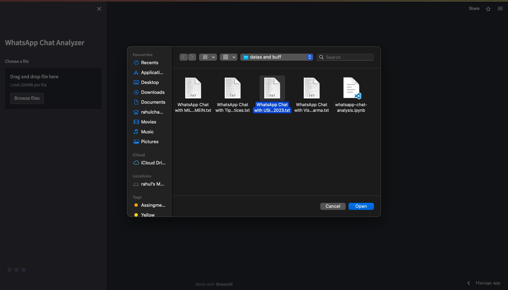
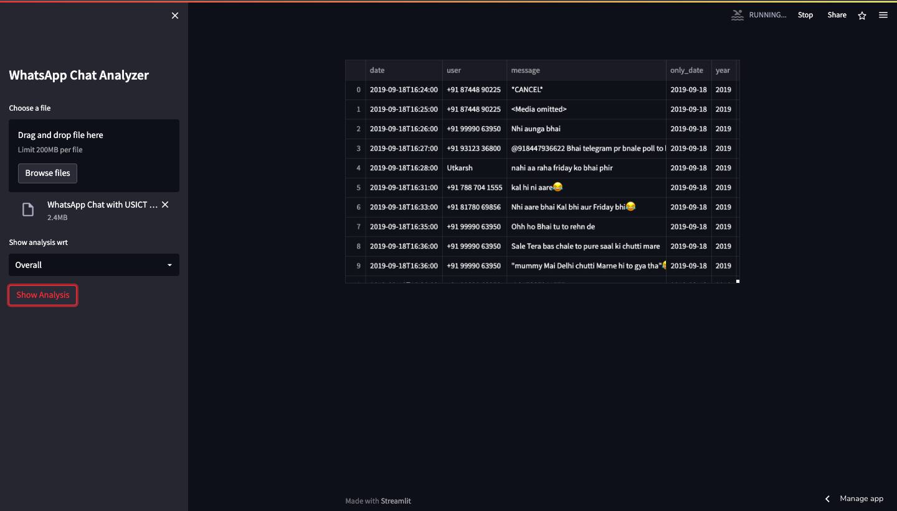
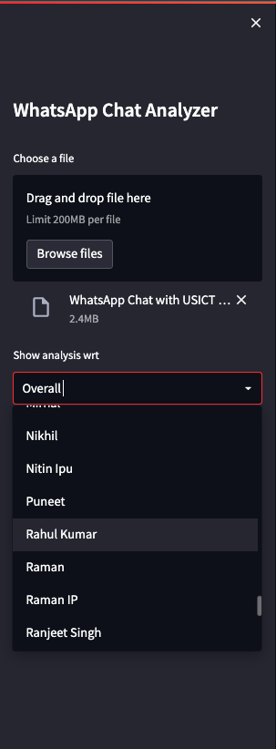
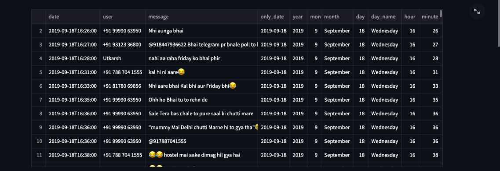

# WhatsApp Chats Analyser

### _Libraries Used_

1. pandas
2. Matplotlib
3. regex
4. seaborn
5. wordcloud
6. urlextract
7. emoji

Click in the browse file menu and upload the chats

Click on show analysis. It will take a momment if the file is big.

You can also select a particular user too get his/her contribution to the group.

After running the streamlit will show the result. First we see that I have outputed the pandas dataframe containing all the chats with a bunch of thousands rows and 11 columns.

